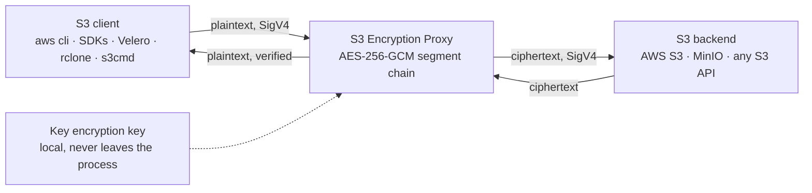

# S3 Encryption Proxy

[](https://github.com/guided-traffic/s3-encryption-proxy/actions)
[](https://github.com/guided-traffic/s3-encryption-proxy)
[](go.mod)
[](LICENSE)

**Put it in front of any S3 bucket and every object lands encrypted — without
changing a single client.** The proxy speaks S3 on both sides: your tools keep
using their endpoint, their credentials and their SDK, while the bytes that
reach the storage backend are an authenticated AES-256-GCM segment chain under a
data key that is unique per object. A backend that modifies, truncates,
reorders or relabels an object does not get that past the proxy — the read is
refused, not reported.



## ✨ Key features

- 🔒 **Transparent** — no client-side change, no SDK plugin, no key on the client. Point the endpoint at the proxy and carry on
- 🔑 **Envelope encryption** — one random AES-256 data key per object, wrapped under your key encryption key with an authenticated wrap that fails closed
- 🛡️ **Authenticated storage** — 64 KiB AES-256-GCM segments plus a sealed trailer; every seal is bound to the object key and the segment index, so a modified, reordered, duplicated or truncated object fails the read
- 🚫 **Foreign objects are refused, not served** — no `s3ep-*` metadata, a format this proxy does not read, or key material that fails its tag answers `403 InvalidObjectState`. There is no pass-through opt-out
- 📤 **Streaming in both directions** — an upload is forwarded to the backend while it is still arriving, and nothing ever buffers a whole object. A `PUT` the proxy splits into an internal multipart upload holds `multipart_part_size` × (1 + `multipart_upload_concurrency`) of part buffers — 60 MiB with the defaults — whatever the object's size
- ⚡ **Ranged reads** — only the segments a window covers are fetched and opened, so byte-range clients (kopia, and therefore Velero volume backups) work at full speed
- 🧾 **Your checksums are verified** — every `Content-MD5` or `x-amz-checksum-*` you declare is checked against the plaintext before a byte reaches the backend, and the proxy seals its own CRC32C and serves it back on `GET` and `HEAD`
- 🔐 **SigV4 client authentication** — the `Authorization` header form and pre-signed URLs, against statically configured clients. No S3 path is anonymous; the two probe endpoints are, and answer nothing about your data
- 🔄 **Key rotation without re-encryption** — every object names the key that wrapped it, so a retired key keeps reading what it wrote while a new one writes
- 🚪 **An exit that needs no licence** — the `exit` provider stores what the client sends and still decrypts everything written before the switch. Getting your data out never depends on a valid licence
- 📊 **Prometheus metrics, two probes and a status document** — including a counter for reads that failed to authenticate, which is the one series worth an alert
- 🧪 **Proven against real clients** — Velero, rclone and s3cmd each run an end-to-end suite against a pinned release of the real binary, every release

## 📛 Naming conventions

Every deterministic name the proxy produces:

| What | Pattern | Notes |
|---|---|---|
| Stored format id | `s3ep-gcm-seg-v2` | The only format written or read |
| Object metadata keys | `s3ep-dek-algorithm`, `s3ep-encrypted-dek`, `s3ep-kek-algorithm`, `s3ep-kek-fingerprint` | Exactly four, never more. `s3ep-` is `encryption.metadata_key_prefix`, and the prefix is the proxy's exclusive namespace in both directions |
| Metadata prefix rule | `^[a-z0-9][a-z0-9-]{2,}-$` | Anything else refuses the start |
| Container environment | `S3EP_BACKEND_ENDPOINT`, `S3EP_BACKEND_REGION`, `S3EP_BACKEND_ACCESS_KEY_ID`, `S3EP_BACKEND_SECRET_KEY`, `S3EP_CLIENT_ACCESS_KEY_ID`, `S3EP_CLIENT_SECRET_KEY`, `S3EP_AES_KEY` | The seven the shipped image reads, all mandatory |
| Licence token | `S3EP_LICENSE_TOKEN`, else `license_file` | Those two and nothing else |
| Metrics | `s3ep_*` | Plus the Go runtime and process collectors |
| Unsigned endpoints | `GET /livez`, `GET /readyz` on the S3 listener; `/metrics`, `/status`, `/livez` on the monitoring listener | A signed or query-carrying request to `/livez` or `/readyz` is an S3 request for a bucket of that name |
| Entity tag marker | `"<32 hex>-0"` | A change token, never a digest of your content |
| Request id | 16 uppercase hex in `x-amz-request-id` | The proxy's own, minted per request, echoed in the access log |
| Binaries | `build/s3-encryption-proxy`, `build/s3ep-keygen`, `build/license-tool` | `make build-all` |

## 📚 Documentation

| Document | What it covers |
|---|---|
| **[docs/operations/](./docs/operations/)** | Running it: configuration guide, deployment, S3 API behaviour, integrity guarantees, monitoring, upgrading, per-client notes |
| **[docs/operations/clients/](./docs/operations/clients/)** | [Velero](./docs/operations/clients/velero.md) · [rclone](./docs/operations/clients/rclone.md) · [s3cmd](./docs/operations/clients/s3cmd.md) |
| **[SECURITY_ARCHITECTURE.md](./SECURITY_ARCHITECTURE.md)** | Threat model, trust boundaries, where keys and secrets live, what the proxy does not defend against, residual risks, how to report a vulnerability |
| **[docs/adr/](./docs/adr/)** | Every design decision: what was decided, why, what was rejected and what it costs |
| **[docs/developer/](./docs/developer/)** | Changing the code: package map, storage format, request paths, multipart, errors, tests, performance |
| **[DEVELOPER.md](./DEVELOPER.md)** · **[CONTRIBUTING.md](./CONTRIBUTING.md)** · **[CHANGELOG.md](./CHANGELOG.md)** | Contributor entry point, how to contribute, release history |

> **Coming from 3.x or 4.x?** Read
> [docs/operations/upgrading.md](./docs/operations/upgrading.md) first. Objects
> written by an earlier release cannot be read by 5.x, and a 4.x configuration
> file stops the proxy at startup until it is brought forward. Both breaks are
> deliberate.

## 🚀 Fast start

### The local demo

```bash
# Needs a licence: export S3EP_LICENSE_TOKEN, or put the token in
# config/license.jwt, which the script picks up on its own.
./start-demo.sh
```

Brings up MinIO, both proxy endpoints and an S3 explorer. The first run
generates the local test PKI and a key encryption key into `.env` — no usable
key is tracked in this repository
([ADR 0021](./docs/adr/0021-key-material-is-generated-never-committed.md)).

| | |
|---|---|
| Proxy | <http://localhost:8080> |
| Proxy over TLS | <https://localhost:8443> (CA: `test/ssl-setup/ca.crt`) |
| Metrics | <http://localhost:9090/metrics> |
| S3 explorer, decrypted view | <http://localhost:8081> |
| MinIO console, the raw stored objects | <https://localhost:9001> (`minioadmin` / `minioadmin123`) |

### The container

The image carries its own configuration and takes every value from an
environment variable, so nothing has to be mounted. Generate the key once and
**keep it** — an object encrypted under a key you have lost is not recoverable:

```bash
export S3EP_AES_KEY="$(openssl rand -base64 32)"

docker run -p 8080:8080 \
  -e S3EP_LICENSE_TOKEN="$S3EP_LICENSE_TOKEN" \
  -e S3EP_BACKEND_ENDPOINT="https://s3.eu-central-1.amazonaws.com" \
  -e S3EP_BACKEND_REGION="eu-central-1" \
  -e S3EP_BACKEND_ACCESS_KEY_ID="$AWS_ACCESS_KEY_ID" \
  -e S3EP_BACKEND_SECRET_KEY="$AWS_SECRET_ACCESS_KEY" \
  -e S3EP_CLIENT_ACCESS_KEY_ID="username0" \
  -e S3EP_CLIENT_SECRET_KEY="a-secret-of-at-least-16-characters" \
  -e S3EP_AES_KEY="$S3EP_AES_KEY" \
  guidedtraffic/s3-encryption-proxy:latest
```

All seven variables are mandatory: an unset or empty one is a named startup
error, so the container cannot come up half-configured, with an empty credential
or without a key. Details and the mount-your-own-configuration form are in
[docs/operations/deployment.md](./docs/operations/deployment.md).

### From source

```bash
git clone https://github.com/guided-traffic/s3-encryption-proxy.git
cd s3-encryption-proxy
make build build-keygen

export S3EP_AES_KEY="$(./build/s3ep-keygen | sed -n 2p)"   # or: openssl rand -base64 32
# point config/aes-example.yaml at a backend you can reach, then:
./build/s3-encryption-proxy --config config/aes-example.yaml
```

### Talk to it

Any S3 client, unchanged:

```bash
aws s3 --endpoint-url http://localhost:8080 cp file.txt s3://my-bucket/
```

```python
import boto3
s3 = boto3.client('s3', endpoint_url='http://localhost:8080')
s3.put_object(Bucket='my-bucket', Key='file.txt', Body=b'data')
```

Path-style addressing is what the proxy serves. Behaviour that differs from a
plain S3 endpoint is in
[docs/operations/s3-api.md](./docs/operations/s3-api.md).

## 🔌 Supported clients

The proxy serves any S3 client, and compatibility is argued from S3 semantics
rather than from one observed client
([ADR 0006](./docs/adr/0006-the-proxy-serves-any-s3-client.md)). Three clients
are proven on every release by an end-to-end suite that drives a pinned release
of the real binary and asserts encryption at rest straight from the backend:

| Client | Proven by | Settings a real deployment needs |
|---|---|---|
| **Velero** (incl. kopia volume backups) | `make e2e-velero` — 13 tests in a `kind` cluster: a preflight plus the V1–V10 backup/restore scenarios, V1b and V8b included | [clients/velero.md](./docs/operations/clients/velero.md) — HTTPS, `s3ForcePathStyle`, and **set the kopia repository password before the first backup** |
| **rclone** | `make e2e-rclone` — R1–R7 over both proxy endpoints | [clients/rclone.md](./docs/operations/clients/rclone.md) — one line: `use_multipart_etag = false` |
| **s3cmd** | `make e2e-s3cmd` — S1–S7 over both proxy endpoints | [clients/s3cmd.md](./docs/operations/clients/s3cmd.md) — `host_bucket = host_base`, and use the TLS endpoint |

The AWS CLI, the AWS SDKs and CNPG Barman database backups are in scope the same
way; they have no suite of their own.

## 🔑 Encryption providers

A provider is the **key encryption key** — how the per-object data key is
wrapped. The data layer is not pluggable: it is the segment chain, always
([ADR 0003](./docs/adr/0003-objects-are-an-authenticated-segment-chain.md)).

| | **`aes`** | **`exit`** |
|---|---|---|
| What it is for | Every deployment that stores data | Leaving the product with your data readable |
| New objects at rest | 🟢 Sealed segment chain, AES-256-GCM | ⚪ Stored exactly as the client sent them |
| Reads what this proxy encrypted | ✅ | ✅ via the `aes` provider that still holds the key |
| Licence required | ✅ | ❌ |
| Key rotation | 🔄 Add the retired key as a second provider | — holds no key material |

Two types exist and nothing else: `type: "none"` is refused by name and pointed
at `exit`, `type: "tink"` is refused by name, and no KMS-backed provider is
implemented — that is decided and unbuilt
([ADR 0005](./docs/adr/0005-a-kms-key-is-a-provider.md)).

### `aes` — the one provider that encrypts

```yaml
encryption:
  encryption_method_alias: "aes-envelope"
  providers:
    - alias: "aes-envelope"
      type: "aes"
      config:
        aes_key: "${S3EP_AES_KEY}"   # base64 of exactly 32 random bytes
```

`aes_key` is base64 of exactly 32 random bytes and nothing else is accepted: a
passphrase, a hex string that was base64-encoded, or a key with fewer than 16
distinct byte values is refused at startup, naming the field. Generate one with
`./build/s3ep-keygen` or `openssl rand -base64 32`.

The key is never used directly. Both the wrapping key and the published
`s3ep-kek-fingerprint` are derived from it with HKDF-SHA256 under separate
labels, and each data key is wrapped with AES-256-GCM under a per-wrap salt. So
the fingerprint reveals nothing about the key, and a wrapped data key that was
tampered with, or that belongs to another key, fails to unwrap instead of
yielding wrong key material
([ADR 0004](./docs/adr/0004-one-local-key-provider.md)).

### Key rotation

Every object names the key that wrapped it, so rotation is a configuration
change and never a re-encryption pass: add the new key, point
`encryption_method_alias` at it, and keep the old one listed for as long as
objects written under it exist.

```yaml
encryption:
  encryption_method_alias: "aes-current"
  providers:
    - alias: "aes-current"
      type: "aes"
      config: { aes_key: "${S3EP_AES_KEY}" }
    - alias: "aes-retired"
      type: "aes"
      config: { aes_key: "${S3EP_AES_KEY_RETIRED}" }
```

**Dropping a retired key makes every object written under it permanently
unreadable.** Every listed provider can decrypt; only the alias writes.

<a id="the-exit-provider"></a>

### `exit` — leaving is a supported mode

The provider you select to **leave the product**. It needs no licence, and that
is the point: getting your data out must never depend on a licence being valid
([ADR 0025](./docs/adr/0025-leaving-is-a-supported-mode.md)).

```yaml
encryption:
  encryption_method_alias: "exit"
  providers:
    - alias: "exit"
      type: "exit"          # no config at all: it holds no key material
    - alias: "aes-previous" # keep the key that wrote what is already there
      type: "aes"
      config: { aes_key: "${S3EP_AES_KEY}" }
```

- **Every write path stores what the client sent.** No data key is drawn, no
  `s3ep-*` metadata is written — so the object at rest is your file, and anyone
  who can read the bucket can read it. The proxy says so in a warning at every
  start
- **Reads still decrypt.** An object encrypted before the switch is opened and
  verified segment by segment
- **The decision is per object**, from that object's own metadata — a bucket on
  the way out legitimately holds both kinds
- **Keep the `aes` provider listed beside it**, or the objects it wrote become
  unreadable. There is no background re-encryption: copying the data out through
  the proxy is the migration

What that costs on the read path, and what a listing reports under it, is in
[docs/operations/s3-api.md](./docs/operations/s3-api.md).

<a id="installation-paths"></a>

## 📦 Installation paths

| Path | Shortest form | Full notes |
|---|---|---|
| **Container image** | `docker run … guidedtraffic/s3-encryption-proxy:latest` with the seven variables above | [deployment.md § Docker](./docs/operations/deployment.md#docker) |
| **Docker Compose** | The same variables in an `environment:` block, no volume and no command | [deployment.md § Docker Compose](./docs/operations/deployment.md#docker-compose) |
| **Kubernetes, Helm** | `helm install s3-encryption-proxy deploy/helm/s3-encryption-proxy --values deploy/helm/s3-encryption-proxy/values-production.yaml --set-file config=config/aes-example.yaml` | [deployment.md § Kubernetes with Helm](./docs/operations/deployment.md#kubernetes-with-helm) and the [chart README](./deploy/helm/s3-encryption-proxy/README.md) |
| **From source** | `make build && ./build/s3-encryption-proxy --config …` | [DEVELOPER.md](./DEVELOPER.md) |

Two things hold on every path:

- **The key encryption key belongs in a secret, never in a rendered
  configuration.** A Helm install renders its proxy configuration into a
  ConfigMap, so a key written there is readable by anyone with `get configmaps`
  in the namespace. Reference it as `${S3EP_AES_KEY}` and point the chart at a
  Secret you manage
- **One instance per release, and the chart refuses a second.** A client-driven
  multipart upload is held by the process that answered `CreateMultipartUpload`,
  so a part balanced onto another pod is answered `404 NoSuchUpload`.
  `replicaCount` above 1 and `autoscaling.enabled: true` both fail the render
  ([ADR 0033](./docs/adr/0033-a-proxy-instance-holds-its-uploads.md))

<a id="configuration"></a>

## ⚙️ Configuration

The proxy reads one YAML file, named with `--config`. **A key it does not define
refuses the start and the error names it** — there is no key that is silently
ignored, and no environment variable overrides one
([ADR 0013](./docs/adr/0013-a-configuration-key-exists-only-if-code-reads-it.md)).
Secrets are written as `${VAR}` references, which are expanded in the backend
credentials, the client credentials and every provider config value.

The smallest file that starts:

```yaml
s3_backends:
  - target_endpoint: "https://s3.eu-central-1.amazonaws.com"  # the scheme decides TLS; http:// is refused
    region: "eu-central-1"
    access_key_id: "${S3_ACCESS_KEY_ID}"
    secret_key: "${S3_SECRET_KEY}"

s3_clients:
  - type: "static"
    access_key_id: "username0"                    # minimum 8 characters
    secret_key: "a-secret-of-at-least-16-chars"   # minimum 16 characters

encryption:
  encryption_method_alias: "aes-envelope"
  providers:
    - alias: "aes-envelope"
      type: "aes"
      config:
        aes_key: "${S3EP_AES_KEY}"
```

Everything else has a default. Complete files for each shape live in
[`config/`](./config/): `aes-example.yaml`, `aes-tls-example.yaml`,
`multi-example.yaml` and `exit-example.yaml`.

<details>
<summary><b>The complete key reference</b> — every key the proxy reads, with its default</summary>

Values marked `# default` are the defaults the loader applies; everything else is
an example. The rules behind the settings that need more than a line — the part
size, the idle timeout, the shutdown budget — are in
[docs/operations/configuration.md](./docs/operations/configuration.md).

```yaml
# Server Configuration
bind_address: "0.0.0.0:8080"  # default
log_level: "info"             # default; trace, debug, info, warn, error, fatal, panic
                              # (logrus level names); an unknown one refuses the start
log_format: "text"            # default; text or json
log_health_requests: false    # default
shutdown_timeout: 30          # example, seconds; 30 applies when unset or 0
                              # The budget an in-flight transfer gets when the
                              # process is asked to stop, and the only
                              # server-side limit on a running transfer. The
                              # Helm chart derives terminationGracePeriodSeconds
                              # from it, as preStopSleepSeconds + this value + 5,
                              # and refuses to render an override below that sum

# Listener budgets, in seconds. The two body budgets are 0 by default, which
# means no deadline: a transfer lasts as long as the client and the backend keep
# it going, whatever the object size and the link speed. Set one only if you
# want a ceiling and know your workload — any finite value makes the largest
# object you can move a function of the client's bandwidth.
read_timeout: 0               # default; 0 = no deadline on reading a request body
write_timeout: 0              # default; 0 = no deadline on writing a response body
# These two bound what is *not* a transfer and may not be 0; startup refuses it.
# read_header_timeout is the only limit on a connection that opens and never
# finishes its headers, and with both budgets above at 0 an idle_timeout of 0
# would hold a keep-alive connection forever.
read_header_timeout: 30       # default
idle_timeout: 60              # default

# TLS listener of the proxy itself (optional)
tls:
  enabled: false                  # default
  # Both are required when tls.enabled, and both files must exist or startup fails
  cert_file: "/certs/public.crt"  # example
  key_file: "/certs/private.key"  # example

# S3 Backend Configuration. The key is a list and this release reads exactly
# one entry; a second refuses the start, and the singular s3_backend is refused
# by name.
s3_backends:
  # The scheme of target_endpoint decides whether the backend connection uses TLS,
  # and it is required: a scheme-less endpoint refuses the start. http:// refuses
  # the start under every provider, the exit provider included — the backend
  # credential would travel in a SigV4 header over plaintext, and aws-sdk-go-v2
  # will not send an unseekable streaming body without TLS.
  - target_endpoint: "https://s3.amazonaws.com"  # example
    region: "us-east-1"               # default, applied per entry
    access_key_id: "your-access-key"  # example
    secret_key: "your-secret-key"     # example
    insecure_skip_verify: false       # default; development only

# S3 Client Authentication. Required: without at least one client the proxy
# refuses to start, and there is no unauthenticated mode.
s3_clients:
  - type: "static"                  # example; the only accepted type
    access_key_id: "client-user"    # example; minimum 8 characters
    secret_key: "minimum-16-chars"  # example; minimum 16 characters
    description: "Client authentication"  # example; optional, logged with a successful authentication

# S3 Security Configuration
s3_security:
  # Applies to both authentication forms. There is no value that switches the
  # check off: 0 is refused at startup rather than read as the default.
  max_clock_skew_seconds: 900  # default, 1 to 3600
  # Longest lifetime a pre-signed URL may declare. Deliberately below the S3
  # maximum of seven days, which is the hard cap this may not exceed: a leaked
  # URL is a bearer credential for exactly as long as it says.
  max_presign_expiry_seconds: 3600  # default, 1 to 604800
  # Verify the SigV4 payload hash against the body the proxy decoded, the way a
  # declared checksum is verified. Off by default: every signed client sends
  # x-amz-content-sha256, so this is a SHA-256 pass over every upload.
  verify_payload_hash: false  # default

# Monitoring
monitoring:
  enabled: false            # default
  bind_address: ":9090"     # default
  metrics_path: "/metrics"  # default
  pprof_enabled: false      # default; /debug/pprof on its OWN listener, not this one
  pprof_bind_address: "127.0.0.1:6060"  # default; with pprof_enabled it must be loopback or startup fails

# License
license_file: "config/license.jwt"  # default

# Encryption Configuration
encryption:
  # The provider that writes. Required as soon as providers are configured, and
  # it has to name one of them.
  encryption_method_alias: "current-provider"  # example
  # An empty or upper-case prefix would disable decryption on the way back, so
  # it is refused at startup rather than normalised.
  metadata_key_prefix: "s3ep-"   # default; must match ^[a-z0-9][a-z0-9-]{2,}-$
  providers:
    - alias: "current-provider"  # example
      type: "aes"                # example; or "exit"
      config: { ... }

# Performance Optimizations
optimizations:
  # Also the declared plaintext size above which a PUT becomes an internal
  # multipart upload. Must be a multiple of 64 KiB.
  multipart_part_size: 12582912         # default 12MB (5MB - 5GB)
  # Parallel UploadPart calls.
  multipart_upload_concurrency: 4       # default, 1 - 32
  # What all open client-driven uploads together may hold for a final part that
  # does not cover whole segments. These three keys decide peak resident memory;
  # the terms are in docs/developer/performance.md, "Memory, what one request costs".
  # The ceiling on a request document the proxy parses whole - every bucket and
  # object sub-resource body, and the Delete document of a batch delete. Its
  # default refuses nothing S3 itself accepts; above it, 400 EntityTooLarge.
  max_request_document_size: 2097152  # default 2MB, 4KB - 64MB
  multipart_short_part_buffer_size: 67108864  # default 64MB, minimum 5MB
  multipart_session_cleanup_interval: 300  # default, seconds, minimum 1 checked at startup
  # Measured from the last part the upload received, not from its start.
  multipart_session_idle_timeout: 3600     # default, seconds, minimum 1
```

</details>

Where a value comes from — the defaults, the file, `${VAR}` expansion, and the
configuration the shipped image starts from — is
[docs/operations/configuration.md](./docs/operations/configuration.md), and the
code-level view is
[docs/developer/configuration.md](./docs/developer/configuration.md).

## 📊 Monitoring

Off on a default install. With `monitoring.enabled: true` a second listener
serves Prometheus metrics and one descriptive `/status` document; the S3
listener always answers two unsigned probe paths.

| Endpoint | Listener | For |
|---|---|---|
| `GET /livez` | S3 | A liveness probe. A constant `200`, on purpose |
| `GET /readyz` | S3 | A readiness probe. `503` from the moment a `SIGTERM` starts the drain |
| `GET /metrics` | monitoring | Prometheus. Thirteen `s3ep_*` series plus the Go runtime collectors |
| `GET /status` | monitoring | A human: build, active provider, what the backend last did, licence. **Nothing automatic may act on it** |

`s3ep_object_integrity_failures_total` is the one series worth an alert — it
counts reads where an object did not authenticate, and it is expected to stay at
zero. Alerting rules ship with the chart, off by default. The full metric table,
the probe semantics and the `/status` document are in
[docs/operations/monitoring.md](./docs/operations/monitoring.md).

<a id="security"></a>

## 🔐 Security

- **🔐 Authenticated encryption** — AES-256-GCM per 64 KiB segment, each seal bound to its segment index and to the object key
- **🔑 Envelope encryption** — KEK/DEK separation with an authenticated key wrap that fails closed. The key encryption key is read at startup and never leaves the process
- **🔒 Client authentication** — AWS Signature V4, both the `Authorization` header and the pre-signed query form. Every S3 path requires a signature; the proxy holds the backend credentials itself, so there is no anonymous access to pass through
- **🚫 Objects this proxy did not write are refused** — `403 InvalidObjectState` on `GET`, `HEAD` and ranged `GET`, never the stored bytes
- **🪞 A response describes the proxy, not the backend** — `<Owner>` is the client's own access key, the completed-multipart `<Location>` names the proxy, and no backend account id, endpoint or checksum reaches a client

What it deliberately does **not** do:

| | |
|---|---|
| **No rate limiting** | Nothing is throttled and nothing is counted per caller. Put a real limiter in front if you need one ([ADR 0014](./docs/adr/0014-authentication-is-sigv4-no-rate-limiting.md)) |
| **Object key names are in the clear** | Every byte of an object is encrypted; its name is not. Backup layouts put namespaces, backup names and schedules there. Encrypting them is specified and unbuilt ([ADR 0023](./docs/adr/0023-filename-encryption-encrypts-directory-segments.md)) |
| **No KMS** | Wrapping a data key with a remote key is specified and unbuilt ([ADR 0005](./docs/adr/0005-a-kms-key-is-a-provider.md)) |
| **No server-side copy** | `CopyObject` and `UploadPartCopy` answer `422 NotSupportedWithEncryption`: a copy runs inside the backend, where the proxy cannot decrypt and re-encrypt |
| **No SSE-C** | `501 NotImplemented`: no read path carries the customer key, so such an object could never be read back |
| **No network policy** | Which namespaces may reach the pod is a property of the cluster, not of the chart ([ADR 0030](./docs/adr/0030-the-network-boundary-belongs-to-the-administrator.md)) |

[SECURITY_ARCHITECTURE.md](./SECURITY_ARCHITECTURE.md) has the trust
boundaries, the secret flow, the privilege footprint and the residual-risk
checklist. Report a vulnerability through
[its last section](./SECURITY_ARCHITECTURE.md#9-reporting-a-vulnerability) —
privately, never as a public issue.

## 🛠 Development

```bash
make deps && make tools    # toolchain
make test-unit             # fast, no infrastructure
./start-demo.sh            # MinIO + both proxy endpoints
make test-integration      # against the running stack
make quality               # fmt, vet, lint
```

`make help` lists the common targets. [DEVELOPER.md](./DEVELOPER.md) is the
contributor entry point — repository layout, the full build/test/lint matrix,
continuous integration, the extension checklists and the project conventions —
and [docs/developer/](./docs/developer/) carries the per-subsystem invariants.
**Read the page for a subsystem before you change it.**

## 📄 License

The proxy is a licensed product and the licence is a startup gate: with an active
provider of type `aes` and no valid licence it refuses to start and names what is
missing ([ADR 0016](./docs/adr/0016-the-license-is-a-startup-gate.md)). The token
is read from `S3EP_LICENSE_TOKEN`, and otherwise from `license_file` — that one
file, with no well-known locations behind it.

**The `exit` provider needs no licence, and that is deliberate.** A licence that
has expired, or one you no longer hold, must never be the reason you cannot read
your own data. What stops is new encryption
([the exit provider](#the-exit-provider)).

Source code terms: [LICENSE](./LICENSE).
