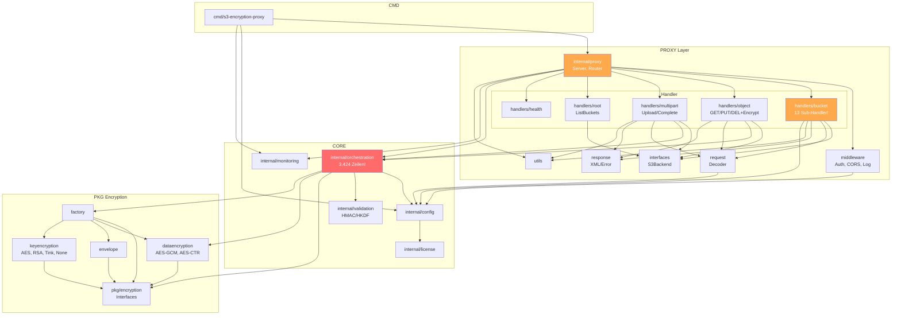

# S3 Encryption Proxy - Architekturanalyse & Optimierungspotenziale

> Generiert am 2026-04-03 mittels `go-callvis` Call-Graph-Analyse und manueller Code-Inspektion.

---

## 1. Generierte Call-Graphen (SVG)

Die folgenden SVG-Dateien wurden mit `go-callvis` generiert und liegen in diesem Ordner:

| Datei | Beschreibung |
|-------|-------------|
| `callgraph_main_entrypoint.svg` | Call-Graph vom `main()`-Einstiegspunkt |
| `callgraph_proxy_layer.svg` | Call-Graph fokussiert auf das `internal/proxy`-Package |
| `callgraph_orchestration_layer.svg` | Call-Graph fokussiert auf das `internal/orchestration`-Package |

---

## 2. Package-Ubersicht mit Codezeilen

```
Package                                   Dateien   Zeilen  Rolle
─────────────────────────────────────────────────────────────────────
cmd/s3-encryption-proxy                       1       277   Einstiegspunkt, CLI, Graceful Shutdown
internal/config                               2       965   YAML-Config, Env-Expansion
internal/license                              3       499   Lizenzvalidierung
internal/monitoring                           3       483   Prometheus Metrics
internal/orchestration                        5     3.424   Encryption Manager (Kern!)
internal/proxy                                5     1.805   Server, Router, Middleware-Setup
internal/proxy/handlers/bucket               16     2.788   Bucket S3-API Handler (13 Sub-Handler!)
internal/proxy/handlers/health                1       121   Health/Version Endpoint
internal/proxy/handlers/multipart             7     1.293   Multipart Upload Handler
internal/proxy/handlers/object                7     2.183   Object CRUD + Verschlusselung
internal/proxy/handlers/root                  2       632   ListBuckets
internal/proxy/interfaces                     1       100   S3BackendInterface (40+ Methoden!)
internal/proxy/middleware                      4       637   Auth, CORS, Logging, Tracking
internal/proxy/request                        5       407   Request Decoder (Chunked, AWS)
internal/proxy/response                       2       252   XML/Error Writer
internal/proxy/utils                          1       280   Hilfsfunktionen
internal/validation                           3       536   HMAC/HKDF
pkg/encryption                                1       120   Interfaces (KEK, DEK, Envelope)
pkg/encryption/dataencryption                 3       440   AES-GCM, AES-CTR
pkg/encryption/envelope                       1       122   Envelope Encryption
pkg/encryption/factory                        1       220   Provider Factory
pkg/encryption/keyencryption                  4       602   AES, RSA, Tink, None KEK
─────────────────────────────────────────────────────────────────────
GESAMT (ohne Tests)                          78    18.464
```

---

## 3. Package-Abhangigkeitsgraph



---

## 4. Identifizierte Probleme & Optimierungspotenziale

### Problem 1: TOTER CODE - `bucket_handlers.go` (804 Zeilen, KOMPLETT UNUSED)

**Datei:** `internal/proxy/bucket_handlers.go`

Diese Datei enthalt **alte Implementierungen** der Bucket-Handler direkt auf dem `Server` struct. Alle Methoden sind mit `//nolint:unused` markiert:

- `handleBucketACL()` - Duplikat von `handlers/bucket/acl.go`
- `handleBucketCORS()` - Duplikat von `handlers/bucket/cors.go`
- `handleBucketPolicy()` - Duplikat von `handlers/bucket/policy.go`
- `handleBucketLocation()` - Duplikat von `handlers/bucket/location.go`
- `handleBucketLogging()` - Duplikat von `handlers/bucket/logging.go`
- `handleBucketVersioning()` - Duplikat von `handlers/bucket/versioning.go`
- `handleBucketAccelerate()` - Duplikat von `handlers/bucket/accelerate.go`
- `handleBucketRequestPayment()` - Duplikat von `handlers/bucket/request_payment.go`
- Div. Hilfsmethoden (`writeNotImplementedResponse`, `writeS3XMLResponse`, etc.)

**Empfehlung:** Datei komplett loschen. Spart ~804 Zeilen.

---

### Problem 2: MASSIVE DUPLIKATION - 13 identische Bucket-Sub-Handler Structs

**Verzeichnis:** `internal/proxy/handlers/bucket/`

Alle 12 Sub-Handler (ACL, CORS, Policy, Tagging, Versioning, Notification, Lifecycle, Replication, Website, Accelerate, RequestPayment, Logging) haben **exakt die gleiche Struct-Definition**:

```go
type XxxHandler struct {
    s3Backend     interfaces.S3BackendInterface
    logger        *logrus.Entry
    xmlWriter     *response.XMLWriter
    errorWriter   *response.ErrorWriter
    requestParser *request.Parser
}
```

Jeder Handler hat einen nahezu identischen Konstruktor `NewXxxHandler(...)`.

**Empfehlung:** Einen generischen `BaseSubResourceHandler` einfuhren:

```go
type BaseSubResourceHandler struct {
    S3Backend     interfaces.S3BackendInterface
    Logger        *logrus.Entry
    XMLWriter     *response.XMLWriter
    ErrorWriter   *response.ErrorWriter
    RequestParser *request.Parser
}
```

Jeder Sub-Handler embeddet dann nur `BaseSubResourceHandler` und implementiert die spezifische `Handle()`-Methode. Das reduziert 12x den gleichen Konstruktor-Code.

---

### Problem 3: DOPPELTE INITIALISIERUNG in `bucket/handler.go`

**Datei:** `internal/proxy/handlers/bucket/handler.go` Zeile 61-73

```go
h.locationHandler = NewLocationHandler(...)   // Zeile 61
h.loggingHandler = NewLoggingHandler(...)     // Zeile 62
// ... andere Handler ...
h.locationHandler = NewLocationHandler(...)   // Zeile 71 (DUPLIKAT!)
h.loggingHandler = NewLoggingHandler(...)     // Zeile 72 (DUPLIKAT!)
```

`locationHandler` und `loggingHandler` werden jeweils **zweimal** initialisiert!

**Empfehlung:** Zeilen 71-72 loschen.

---

### Problem 4: DOPPELTES ROUTING - Router + Handler dispatcht Query-Parameter

**Dateien:** `internal/proxy/router.go` + `internal/proxy/handlers/bucket/handler.go`

Der Router in `router.go` routet bereits Bucket-Sub-Resources per Query-Parameter:
```go
s3Router.HandleFunc("/{bucket}", bucketHandler.GetACLHandler().Handle).Queries("acl", "")
s3Router.HandleFunc("/{bucket}", bucketHandler.GetCORSHandler().Handle).Queries("cors", "")
```

**Gleichzeitig** dispatcht `bucket/handler.go:Handle()` nochmal per Query-Parameter:
```go
if _, hasACL := query["acl"]; hasACL { h.aclHandler.Handle(w, r) }
if _, hasCORS := query["cors"]; hasCORS { h.corsHandler.Handle(w, r) }
```

Das doppelte Routing ist redundant. Die `Handle()`-Methode wird nur als Fallback fur `GET/PUT/DELETE/HEAD` ohne Query-Parameter aufgerufen (Zeile 85-86 in router.go).

**Empfehlung:** Die Query-Parameter-Checks in `bucket/handler.go:Handle()` entfernen - das Routing ist bereits vollstandig im Router. `Handle()` muss nur noch `handleBaseBucketOperations()` aufrufen.

---

### Problem 5: `orchestration.Manager` ist ein GOD OBJECT (3.424 Zeilen)

**Datei:** `internal/orchestration/manager.go`

Der Manager kombiniert:
- Streaming-Verschlusselung (GCM + CTR)
- Streaming-Entschlusselung
- HMAC-Berechnung/-Validierung
- Buffer-Pool-Management
- Background-Cleanup
- Content-Type-basiertes Routing
- Reader-Wrapper (`encryptionReader`, `decryptionReader`, `hmacValidatingReader`)

Er delegiert bereits an `ProviderManager`, `MetadataManager`, `MultipartOperations`, aber die eigentliche Encryption/Decryption-Logik ist noch direkt im Manager.

**Empfehlung:** Aufteilen in:
1. `Manager` (Coordinator nur) - ~100 Zeilen
2. `SinglePartEncryptor` (GCM/CTR Encryption/Decryption) - ~800 Zeilen
3. `StreamingIO` (Reader-Wrapper, Buffer-Pool) - ~600 Zeilen
4. Die existierenden `MultipartOperations`, `ProviderManager`, `MetadataManager` bleiben

---

### Problem 6: `MetadataManager` hat REDUNDANTE METHODEN

**Datei:** `internal/orchestration/metadata.go` (477 Zeilen, 25 exportierte Methoden)

Doppelte/redundante Methoden:
| Methode A | Methode B | Problem |
|-----------|-----------|---------|
| `FilterMetadataForClient()` | `FilterEncryptionMetadata()` | Machen das gleiche |
| `ValidateEncryptionMetadata()` | `ValidateMetadata()` | Nahezu identisch |
| `GetAlgorithm()` | `GetAlgorithmFromMetadata()` | Gleiche Logik |
| `addMetadataPrefix()` | `BuildMetadataKey()` | Identisch |

**Tatsachlich genutzte Methoden** (aus Grep-Analyse):
- `GetMetadataPrefix` (7x), `GetAlgorithm` (4x), `GetHMAC` (3x), `GetFingerprint` (3x), `GetEncryptedDEK` (3x), `SetHMAC` (2x), `GetIV` (2x), `BuildMetadataForEncryption` (2x), `FilterMetadataForClient` (1x)

**Ungenutzte Methoden:** `ExtractEncryptionMetadata`, `GetKEKAlgorithm`, `ValidateEncryptionMetadata`, `BuildMetadataKey`, `ExtractMetadataKey`, `IsEncryptionMetadata`, `FilterEncryptionMetadata`, `ExtractRequiredFingerprint`, `ValidateMetadata`, `AddStandardMetadata`, `GetAlgorithmFromMetadata`, `CreateMissingKEKError`, `ValidateConfiguration`

**Empfehlung:** 13 ungenutzte Methoden entfernen. Spart ~200 Zeilen und reduziert die kognitive Komplexitat erheblich.

---

### Problem 7: `S3BackendInterface` ist MONOLITHISCH

**Datei:** `internal/proxy/interfaces/s3_backend.go` (100 Zeilen, 40+ Methoden)

Ein einziges Interface mit allen S3-Operationen. Jeder Handler, der nur ListBuckets braucht, muss trotzdem das komplette Interface implementieren (oder mocken).

**Empfehlung:** Interface Segregation:
```go
type BucketReader interface {
    GetBucketAcl(...) ...
    GetBucketCors(...) ...
    GetBucketLocation(...) ...
    // ...
}

type ObjectOperator interface {
    GetObject(...) ...
    PutObject(...) ...
    DeleteObject(...) ...
    HeadObject(...) ...
}

type MultipartOperator interface {
    CreateMultipartUpload(...) ...
    UploadPart(...) ...
    CompleteMultipartUpload(...) ...
    // ...
}

// Gesamtinterface fur Backward-Kompatibilitat
type S3BackendInterface interface {
    BucketReader
    ObjectOperator
    MultipartOperator
}
```

---

### Problem 8: `ProviderManager` hat DOPPELTE METHODEN

| Methode A | Methode B |
|-----------|-----------|
| `ClearKeyCache()` | `ClearCache()` |
| `GetLoadedProviders()` | `GetAllProviders()` |

**Empfehlung:** Jeweils eine Variante loschen.

---

## 5. Zusammenfassung der Quick-Wins

| # | Aktion | Geschatzter Gewinn | Risiko |
|---|--------|-------------------|--------|
| 1 | `bucket_handlers.go` loschen | -804 Zeilen | Kein (unused) |
| 2 | Doppelte Init in `bucket/handler.go` fixen | Bug-Fix | Kein |
| 3 | 13 ungenutzte MetadataManager-Methoden entfernen | -200 Zeilen | Gering |
| 4 | Doppelte ProviderManager-Methoden entfernen | -50 Zeilen | Gering |
| 5 | Redundantes Query-Routing in `Handle()` entfernen | -60 Zeilen, Klarheit | Gering |
| 6 | `BaseSubResourceHandler` Embedding | -300 Zeilen Boilerplate | Mittel |

**Gesamt Quick-Wins: ~1.400 Zeilen weniger (7.5% der Codebasis)**

---

## 6. Langerfristige Refactoring-Vorschlage

| # | Aktion | Aufwand | Nutzen |
|---|--------|---------|--------|
| A | `orchestration.Manager` aufteilen | Hoch | Deutlich bessere Lesbarkeit/Testbarkeit |
| B | `S3BackendInterface` segregieren | Mittel | Bessere Testbarkeit, kleinere Mocks |
| C | Generisches Passthrough-Handler-Pattern | Mittel | Bucket-Handler auf ~1/3 reduzieren |
